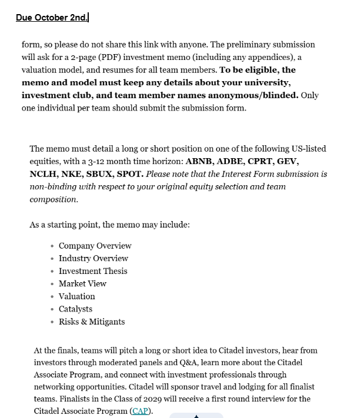

# Competition directives

Preliminary submission requirements for the HFAC x Citadel stock pitch, from the organizers' instructions (screenshot below).

**Due: October 2, 2026.**

## Submission checklist

- [ ] 2-page investment memo as a **PDF**, appendices included in the 2 pages
- [ ] Valuation model
- [ ] Resumes for all team members
- [ ] Memo and model are **anonymized**: no university, investment club or team member names
- [ ] Only one person per team submits the form (Vignesh)
- [ ] Do not share the submission form link

## Rules

- Long or short position on one of: ABNB, ADBE, CPRT, GEV, NCLH, NKE, SBUX, SPOT (we are short CPRT)
- 3–12 month time horizon
- Suggested memo sections: company overview, industry overview, investment thesis, market view, valuation, catalysts, risks and mitigants
- The interest form is non-binding on equity choice and team composition

## Finals

Teams pitch to Citadel investors, with panels, Q&A and networking. Citadel covers travel and lodging for finalists. Class of 2029 finalists get a first-round interview for the Citadel Associate Program.

